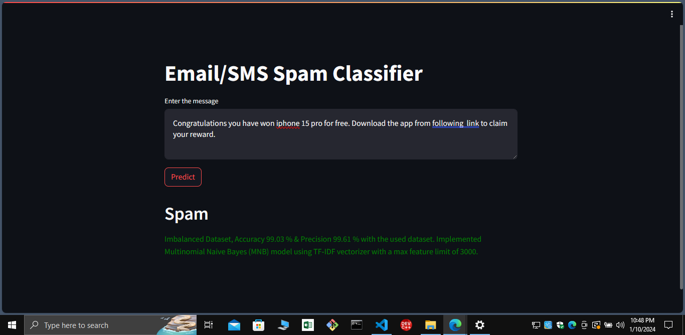
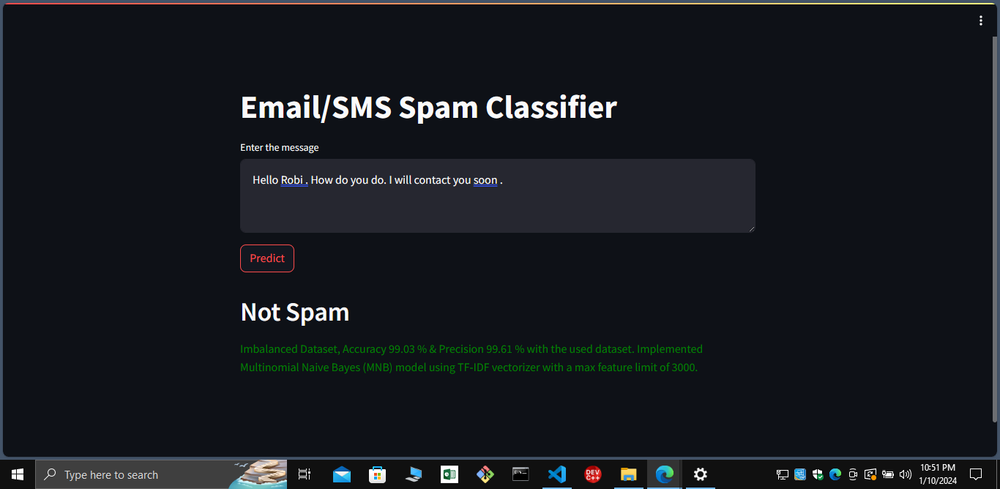

# Email/SMS Spam Detection using Machine Learning

## Overview
This repository contains a machine learning project to classify Email or SMS messages as either spam or ham (not spam). The primary objective is to develop an efficient classification model using basic Natural Language Processing (NLP) tools and machine learning algorithms.

## Project Flow
1. Data Cleaning: Removed unnecessary columns from the dataset.
2. Exploratory Data Analysis (EDA): Analyzed the distribution and characteristics of spam and ham messages.
3. Text Preprocessing:
Lowercased text.
Tokenization, removing special characters, punctuation, and stop words.
Stemming using Porter stemmer. 

4. Feature Engineering: Added columns representing the number of characters, words, and sentences in each SMS.  
5. Model Building:
Used Multinomial Naive Bayes algorithm for classification.
Vectorized text data using TF-IDF (Term Frequency-Inverse Document Frequency), with max feature of 3000, vectorization.

6. Evaluation:
Assessed model performance using accuracy and precision metrics.
Observed improvements by adjusting vectorization parameters and trying different algorithms like Random Forest.

## Clone repository
```bash
git clone https://github.com/ich-bin-sudip/email-sms_spam_detection.git
```
### Run project
Create a virtual env (recommended) and install the requirements.
``bash
pip -r requirements.txt
```
Then run the project using streamlit
```bash
  streamlit run app.py
```

## Model Deployment
After training and evaluating the model, you can deploy it for real-time classification. Use the provided pickled files (vectorizer.pkl and model.pkl) to vectorize incoming text data and make predictions using the trained model. I have deploy the model on render using streamlit app . 

## Screenshots




## Conclusion
The project demonstrates the effectiveness of the Multinomial Naive Bayes algorithm coupled with TF-IDF vectorization for SMS spam detection. By analyzing and preprocessing textual data, we built a robust classification model achieving high accuracy and precision.

#### For any questions or improvements, feel free to reach out.


